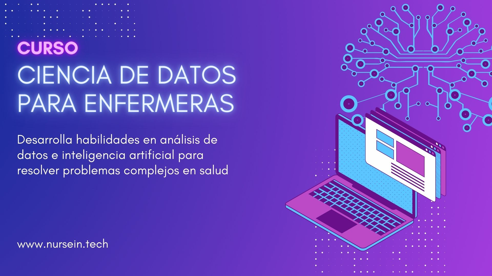

# Curso de Ciencia de Datos para Enfermeras/os

En **Nurse in Tech** queremos incorporar la innovación tecnológica, programación e inteligencia artificial en el quehacer habitual de Enfermería y ayudar a reducir la brecha de género presente en esta área. Por eso, realizaremos este curso.

Este curso se enmarca en el desarrollo de competencias avanzadas en análisis de datos aplicado a salud y al rol profesional de Enfermería.

En este repositorio iremos dejando el material de curso, como los scripts, documentación y ejercicios.

## 

## Requisitos previos al curso

1.  [Instala R](https://cloud.r-project.org/) en tu computador. Elige la versión que corresponda a tu sistema operativo.

2.  Instala [RStudio](https://posit.co/download/rstudio-desktop/).

3.  Crea una cuenta en GitHub.

4.  Asegúrate de estar registrado y activo en el Discord de [Nurse in Tech](https://nursein.tech/).

➡️ CURSO YA FINALIZADO
